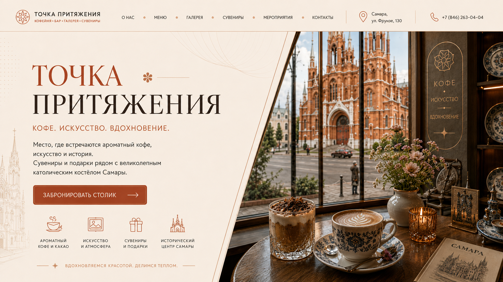

# Точка притяжения

Демонстрационный сайт кофейни, бара и галереи в Самаре. Адаптивный интерфейс, меню, фотогалерея, сувениры, события и контакты в единой визуальной композиции.



[Открыть демо](https://kaigo.space/site/dotgravity/)

## Реализация

- React и TypeScript, Next.js-совместимые маршруты через Vinext/Vite.
- Адаптивные секции, навигация по странице, галерея и прямые действия для связи с заведением.
- Локальные оптимизированные изображения и отдельные декоративные слои.
- Vitest, Playwright, accessibility-проверки и сравнение с визуальными референсами.

## Локальный запуск

Node.js 22.13 или новее.

```bash
npm ci
npm run dev
```

Порт показывает сервер разработки в терминале. Сборка и доступные проверки:

```bash
npm run build
npm test
npm run qa:assets
```

Браузерные и визуальные сценарии описаны в `package.json` и `tests/`; для них потребуется Chromium из Playwright. Зависимости проекта включают `vinext` и `@openai/sites-vite-plugin`.

## О проекте

Портфолио-демо, не заявление об официальном сотрудничестве с заведением. Документальные фотографии, сгенерированные иллюстрации и материалы референсов имеют разные источники; права на фотографии и бренд не передаются вместе с кодом. Назначение ассетов и материалы проверок сохранены в `docs/`.

Превью - сохранённый desktop-кадр из визуальных проверок проекта. Наличие команд тестов не означает, что они выполнялись при последнем обновлении README.
